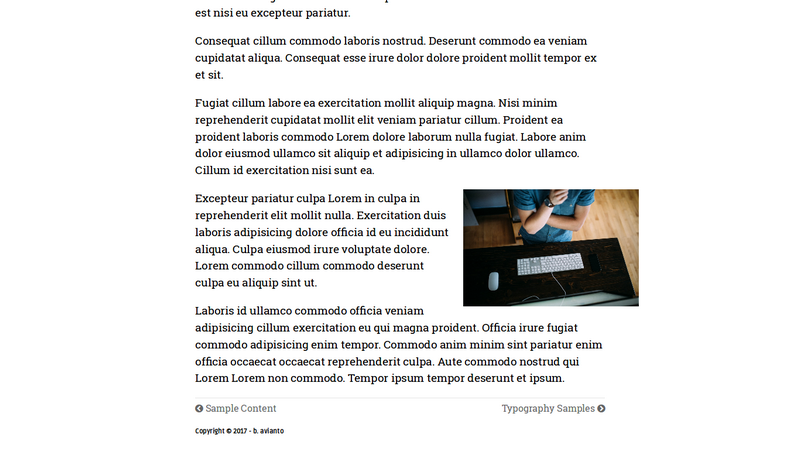

# Kiera Theme for Hugo

Kiera is the theme specialized in presenting writing layout like long essay or technical writing.

## Main Features

* 4 image placements with `figure` support using shortcodes.
* Excellent code highlight support thanks to Hugo Chroma. 
* Use Font Awesome for icons (Cloudflare CDN)
* Utilize normalize.css for consistent styling (Cloudflare CDN)
* Use Google Fonts: Ruda (serif) and Roboto Slab (sans-serif)
* Disqus comment loaded on demand

## Installation 

Change into Hugo directory then:

```console
$ cd themes
$ git clone https://github.com/avianto/hugo-kiera.git kiera
```

More detailed instruction at [Hugo Docs](http://gohugo.io/themes/installing-and-using-themes/).

Using `git submodule` is recommended instead of `git clone` as per recommendation from [Netlify](https://gohugo.io/hosting-and-deployment/hosting-on-netlify/#use-hugo-themes-with-netlify).

```console
$ cd themes
$ git submodule add https://github.com/avianto/hugo-kiera.git kiera
```

## Configuration

*Important*: delete or move `archetypes` folder from root unless it is necessary. Current Hugo priority lookup will look into this folder first before any other `archetypes` folder and could cause problem.

Recommended optional `config.toml`:

```toml
pygmentsCodeFences = true

disqusShortname = "" #Disqus shortname
googleAnalytics = "" #Google Analytics ID

[author]
    name = ""       #Author name
    github = ""     #Github username
    gitlab = ""     #Gitlab username
    linkedin = ""   #LinkedIn username
    facebook = ""   #Facebook username
    twitter = ""    #Twitter username
    instagram = ""  #Instagram username

[params]
    tagline = "the tagline for this website"
```

## Main Menu

Add regular non-posts related page (eq. About page) to main menu by adding these lines to the page front matter:

TOML:

```toml
menu = "main"
meta = "false"
```

YAML:

```yml
menu: "main"
meta: "false"
```

```meta``` refers to time, categories, tags and reading time which are not necessary for this kind of page.

For posts listing page, add `_index.md` file inside `content\posts` folder with these front matter:

TOML:

+++
title = "Posts"
menu = "main"
weight = "10"
+++

```

## Categories & Tags

Both can be used, also can use only one of them or neither.

## Images

Kiera supports adding image as `img` tag with standard Markdown:

``

to wrap it with `figure` use:

``

The basic placement is 100% width within content and scaled accordingly in smaller screen. Recommended width for image is 600 pixels minimum.

Kiera supports different placement by adding:

* For `img`, use ``
* For `figure`, use ``

There are 4 configured placements

* `#full` or `class="full"` for full width.

* `#mid` or `class="mid"` for middle:

* `#float` or `class="float"` for float left:

* `#float-right` or `class="float-right"` for float right:


## Code Hightlight

Using fenced code with Chroma support.

## Font Awesome icons

For usage, refer to [Font Awesome](https://fontawesome.io).

## Disqus On Demand

Disqus comments are loaded on demand, by clicking <kbd>View Comments</kbd> button.

## Support and Pull Requests

Please use GitHub issues to file bugs. If you can help fixing bugs, optimize the theme or adding features, please do pull requests, I really love to see what others can come up with.

## TO DO

* /layout/_default/terms.html needs some works, it functions now, barely.
* Adding some user-oriented behavior using JavaScripts.
* Lazyload images.
* i18n support


